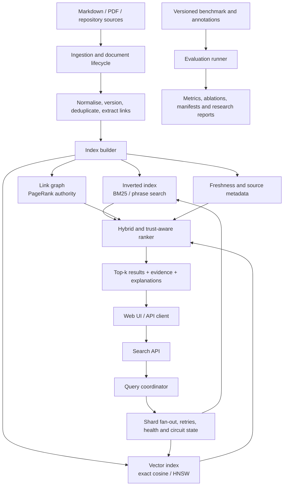

<div align="center">

# NEBULA

### Trust-oriented, explainable hybrid search for engineering knowledge

NEBULA is a research-driven search platform that helps engineering teams find, verify, and trust technical knowledge.

[](https://github.com/Bishrav/NEBULA/actions/workflows/validation.yml)
[](https://github.com/Bishrav/NEBULA)
[](benchmarks/evaluation/README.md)
[](https://openjdk.org/)
[](https://www.python.org/)

**[Repository](https://github.com/Bishrav/NEBULA)** · **[Architecture](docs/architecture/overview.md)** · **[Research plan](docs/research/research-plan.md)**

</div>

> **Project status:** Core retrieval, trust ranking, graph authority, HNSW experimentation, distributed resilience, evaluation, and reproducibility foundations are implemented. Academic supervision, ethics review, human-study work, and external production integrations are intentionally pending.

## Why NEBULA?

Engineering knowledge is spread across READMEs, architecture decisions, runbooks, incident reports, API specifications, and project notes. Keyword search misses meaning; opaque AI search can produce plausible answers without enough evidence, freshness, or ownership context.

NEBULA treats search as a measurable systems and research problem:

> **Relevance + semantic meaning + freshness + authority + graph context + evidence + resilience**

The result is designed to answer not only **“what matches?”**, but also **“why this result, how trustworthy is it, and what happens when part of the system fails?”**

## Project at a glance

| Dimension | NEBULA focus |
| --- | --- |
| Product | Self-hostable search for engineering knowledge |
| Research area | Information retrieval, trustworthy AI, distributed systems, empirical systems evaluation |
| Core question | How do observable trust-related signals affect relevance and verifiability over simpler retrieval baselines? |
| Current data | Versioned public-safe synthetic engineering corpus and labelled query set |
| Evaluation | Precision@k, Recall@k, MRR, NDCG, HNSW recall, latency, graph metrics, and failure behaviour |
| Engineering principle | Build the core from first principles so trade-offs remain inspectable and reproducible |
| Academic readiness | Research plan, study-registration draft, annotation protocol, held-out split, and release gate |

## What is implemented

### Retrieval and ranking

- Inverted indexing, TF-IDF, BM25, phrase queries, and deterministic tie-breaking
- Semantic hashing and character n-gram retrieval baselines
- Exact cosine search and a custom HNSW approximate-nearest-neighbour index
- Hybrid lexical-semantic ranking with score normalisation
- Reciprocal Rank Fusion (RRF) as a score-scale-robust hybrid baseline
- Freshness, source authority, graph/PageRank, and trust-oriented ranking variants
- Evidence-oriented result explanations and machine-readable evaluation reports

### Distributed and reliable search

- Consistent-hash document placement and query fan-out
- Deterministic global top-k result merging
- Primary/replica indexing and replica failover
- HTTP shard clients with bounded retries and timeouts
- API-token protected shard traffic
- Endpoint registry, health monitoring, circuit breaking, and explicit partial-result reporting

### Research and reproducibility

- Versioned synthetic corpus, query judgements, trust metadata, and benchmark fixtures
- Frozen development/held-out evaluation split: 20 development queries and 10 held-out queries
- Reproducible experiment manifests with Git revision, file sizes, and SHA-256 checksums
- Ranking, ANN, graph, and embedding ablation reports
- Annotation validation, agreement analysis, adjudication packets, and release-quality gates
- GitHub Actions validation, Java integration tests, Python tooling tests, and Docker builds

## System architecture



### Request lifecycle

```text
source document
  -> canonical version
  -> normalised fields and tokens
  -> lexical / vector / graph indexes
  -> shard query
  -> local ranking
  -> coordinator merge
  -> trust-aware reranking
  -> evidence-backed response
```

### Reliability model

```text
query
  -> coordinator
  -> shard fan-out
       ├─ healthy shard       -> results
       ├─ transient failure   -> bounded retry
       ├─ primary unavailable -> replica recovery
       └─ repeated failure    -> circuit opens + partial-result metadata
  -> deterministic global top-k response
```

## Technology stack

| Layer | Current technology | Role |
| --- | --- | --- |
| Search algorithms | Java 17 | Indexing, BM25, ranking, vectors, HNSW, graph, sharding, replication |
| API and services | Java HTTP server | Search API, health/readiness, metrics, shard communication |
| Frontend | HTML, CSS, vanilla JavaScript | Lightweight search interface and demo experience |
| Research tooling | Python 3.x | Dataset validation, agreement analysis, manifests, reports, PMF analysis |
| Deployment | Docker and Docker Compose | Reproducible local and pilot-like runtime |
| Observability | Prometheus-compatible metrics | Search and coordinator health signals |
| Quality | GitHub Actions | Compilation, tests, research-tool validation, container build, benchmark checks |
| Data format | Versioned PSV, JSON, Markdown, CSV | Human-readable labels, machine-readable reports, publication tables |
| Version control | Git and GitHub | Traceable milestone commits and reproducible source history |

### Planned production integrations

PostgreSQL for metadata and job state, object storage for raw documents and index snapshots, Redis or a durable coordination service, OpenTelemetry/Grafana dashboards, authenticated connectors, and Kubernetes deployment are future integration work. They are intentionally separated from the current first-principles research core.

## Research design

### Research question

**Does adding freshness, source-authority, graph, and evidence signals to hybrid lexical-semantic retrieval improve retrieval quality and user verifiability compared with lexical-only, semantic-only, and conventional hybrid baselines?**

### Baselines and comparisons

1. BM25 lexical retrieval
2. Semantic retrieval
3. Hybrid lexical-semantic retrieval with weighted score fusion
4. Reciprocal Rank Fusion with fixed rank constant `k=60`
5. Authority-only and freshness-only variants
6. Trust-oriented combined ranking
7. Exact vector search versus custom HNSW
8. Healthy, degraded, replica-recovery, and partial-result distributed scenarios

### Research safeguards

- The current corpus is synthetic and public-safe; it is not presented as human-subject evidence.
- Development queries are separated from a frozen held-out split before future tuning.
- Claims must be supported by generated reports and checksum-backed experiment manifests.
- Human evaluation, recruitment, consent, and publication require university guidance and approval. The draft submission package is in docs/research/human-study; it is not approval or participant evidence.
- Annotation disagreements are measured before adjudication; unresolved labels cannot enter a release package silently.

## Evidence of engineering quality

- Automated CI compiles production and test sources, builds the deployment container, runs integration tests, and validates research tooling.
- Evaluation outputs include Markdown reports, JSON results, CSV publication tables, ANN benchmarks, graph diagnostics, and embedding ablations.
- Experiment manifests record the exact code revision and input checksums.
- Failure paths are explicit: retries are bounded, circuits open, replicas recover, and partial results are observable.
- The project uses focused commits for each completed feature so its evolution can be reviewed chronologically.

## Quick start

### Run the browser UI locally

NEBULA includes a dependency-free search workspace in `apps/search-ui`. Run
the API first, then serve the UI on an unused local port. The examples below
use port `5174` so they do not conflict with other projects commonly using
`5173`:

```powershell
docker compose -f infrastructure/docker/compose.yaml up --build -d
python -m http.server 5174 --directory .\apps\search-ui
```

Open [http://127.0.0.1:5174](http://127.0.0.1:5174). The API runs at
`http://127.0.0.1:8082`, and the Compose configuration allows the UI origin by
default. Try `shard failure`, `deployment rollback`, or `hybrid retrieval`.

### Run the search API with Docker

```powershell
docker compose -f infrastructure/docker/compose.yaml up --build
```

Verify readiness:

```powershell
Invoke-WebRequest http://127.0.0.1:8082/health/ready
```

The container uses the versioned synthetic evaluation corpus. For a different UI
port, set `NEBULA_ALLOWED_ORIGIN` to the exact browser origin before starting
Compose. Before any wider deployment, configure secrets through a secret
manager, authentication, TLS, backups, and operational alerting.

### Run the evaluation suite

After compiling the Java sources into `build/classes`:

```powershell
java -cp build/classes com.nebula.evaluation.EvaluationRunner `
  benchmarks/evaluation/corpus-v1 `
  benchmarks/evaluation/queries-v1.psv `
  benchmarks/evaluation/trust-v1.psv `
  reports/generated/benchmark.md `
  reports/generated/benchmark.json
```

For research reporting, run the same evaluator separately with `queries-v1-train.psv` and `queries-v1-heldout.psv`. Never tune against the held-out file.

## Repository map

```text
apps/search-ui/             Lightweight browser search interface
services/ingestion/         API, ingestion lifecycle, shard and telemetry services
algorithms/lexical/         Indexing, ranking, vectors, HNSW, graph and coordinator code
benchmarks/evaluation/      Synthetic corpus, labels, splits and evaluation instructions
tools/                      Validation, agreement, manifest and research-report tooling
infrastructure/docker/      Dockerfile, Compose deployment and operations notes
docs/architecture/          System design and architecture constraints
docs/research/              Research plan, protocols, annotation and approval materials
.github/workflows/          Continuous integration and release-quality checks
```

## Documentation and academic review

- [System architecture](docs/architecture/overview.md)
- [Research plan](docs/research/research-plan.md)
- [Formal ranking model and signal definitions](docs/research/ranking-model.md)
- [Repository research audit](docs/research/repository-audit.md)
- [Research-readiness dashboard](docs/research/research-readiness.md)
- [Publication claim ledger](docs/research/claim-ledger.md)
- [Statistical analysis protocol](docs/research/statistical-analysis.md)
- [Public corpus acquisition plan](docs/research/public-corpus-acquisition.md)
- [ANN scalability benchmark](docs/research/ann-scaling.md)
- [Study registration draft](docs/research/study-registration.md)
- [Pilot protocol](docs/research/pilot-protocol.md)
- [Annotation guide](docs/research/annotation-guide.md)
- [Evaluation dataset and frozen held-out split](benchmarks/evaluation/README.md)
- [Docker deployment guide](infrastructure/docker/README.md)

## Roadmap

| Status | Workstream |
| --- | --- |
| Complete | Retrieval baselines, trust-related signals, graph ranking, distributed coordinator, replication, health, circuit monitoring, and the local search UI |
| Complete | Synthetic evaluation set, annotation workflow, agreement analysis, adjudication, release gate, manifests and research report generation |
| In progress | Public corpus acquisition, research query construction, research scope refinement, and product-market-fit interviews |
| External | Ethics determination, recruitment, informed consent, human annotation, user study, and publication decision |
| Planned | Authenticated external connectors, durable metadata/object storage, production observability, and grounded answer generation |

## Responsible use

Do not commit private company documents, credentials, production indexes, API keys, participant data, or unapproved research exports. Use synthetic, public, or explicitly consented documents. Permission-aware retrieval is a prerequisite before connecting private sources.

## License

License selection will be made before the first public implementation release.

## Project thesis

Engineering teams do not only need relevant search results; they need results they can verify and trust. NEBULA makes evidence, freshness, authority, explainability, and resilience first-class retrieval concerns.
